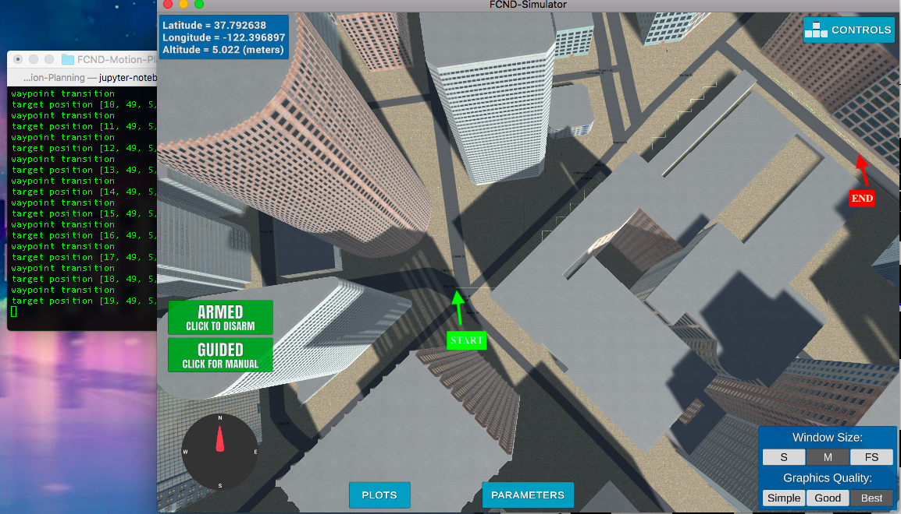
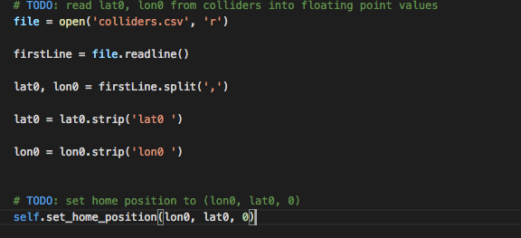
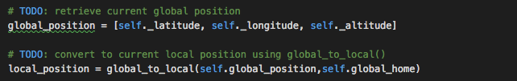
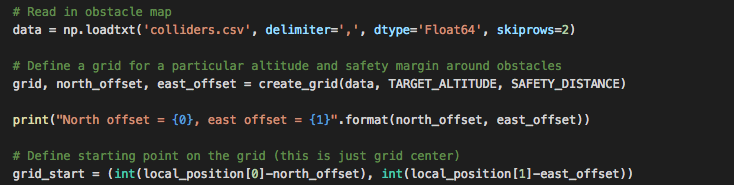
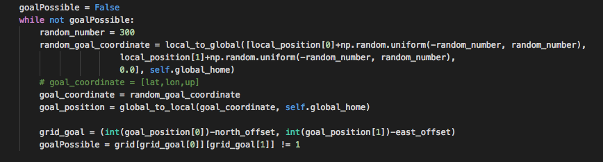
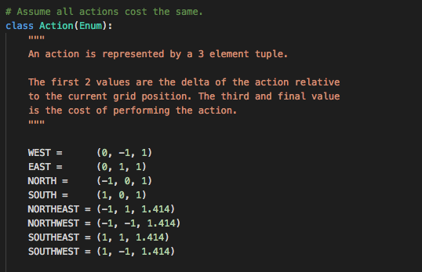
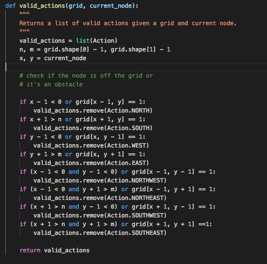
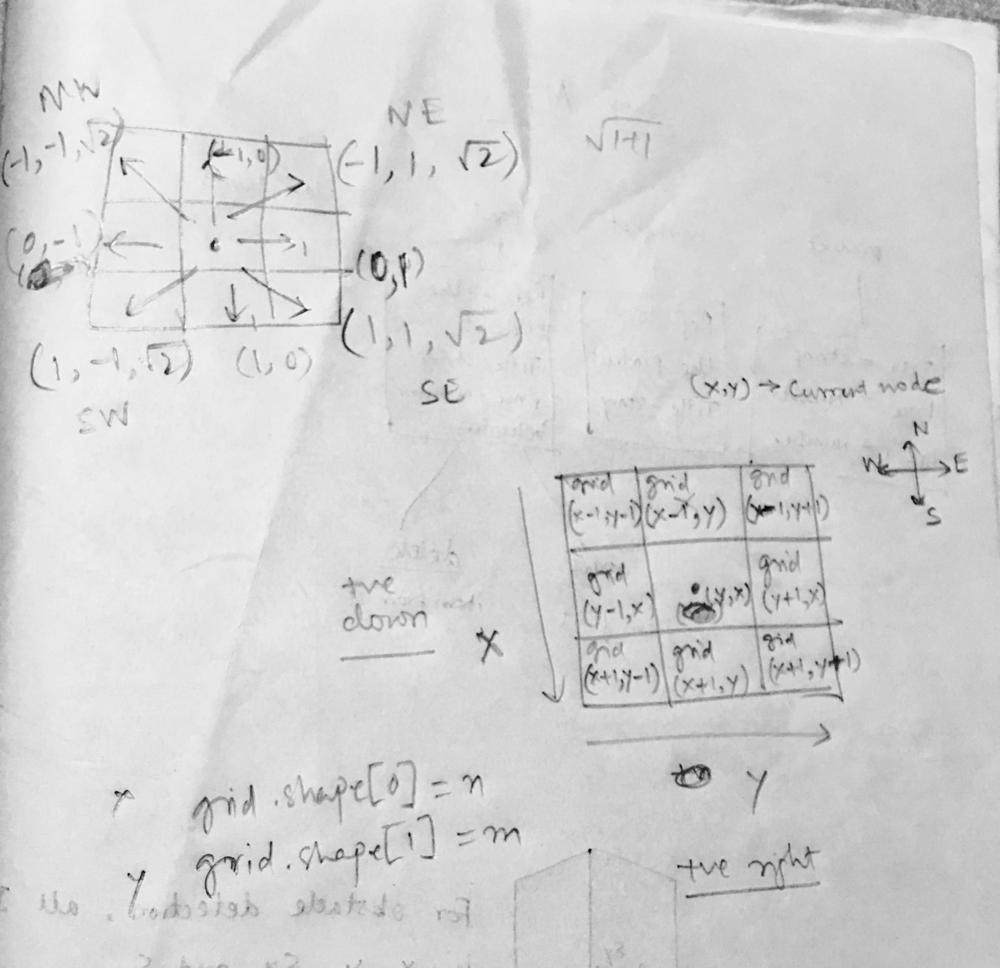
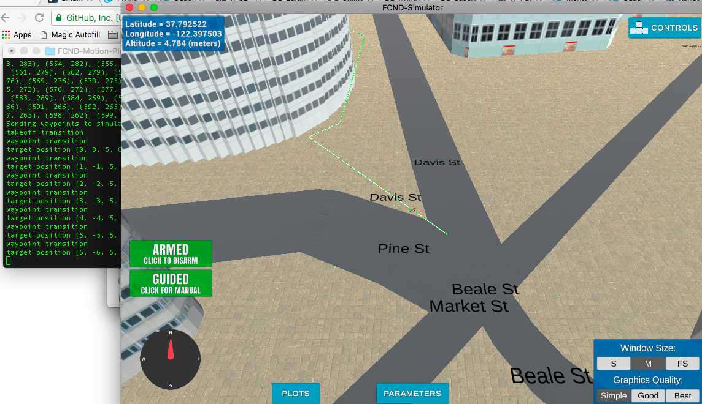
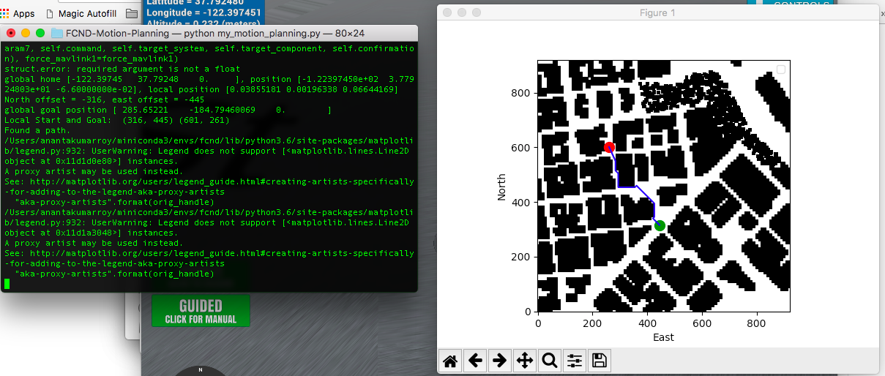

## Project: 3D Motion Planning

---

# Required Steps for a Passing Submission:
1. Load the 2.5D map in the colliders.csv file describing the environment.
2. Discretize the environment into a grid or graph representation.
3. Define the start and goal locations.
4. Perform a search using A* or other search algorithm.
5. Use a collinearity test or ray tracing method (like Bresenham) to remove unnecessary waypoints.
6. Return waypoints in local ECEF coordinates (format for `self.all_waypoints` is [N, E, altitude, heading], where the drone’s start location corresponds to [0, 0, 0, 0].
7. Write it up.

## [Rubric](https://review.udacity.com/#!/rubrics/1534/view) Points
### The following points are the rubrics and how I met the requirements. 

---
### Writeup / README

#### 1. Provide a Writeup / README that includes all the rubric points and how you addressed each one.  You can submit your writeup as markdown or pdf.  

You're reading it! Below I describe how I addressed each rubric point and where in my code each point is handled.

### Explain the Starter Code

#### 1. Explain the functionality of what's provided in `motion_planning.py` and `planning_utils.py`
##### - planning_utils.py
This script file has the methods which are required for the motion planning to work.
- create_grid --> to create a 2D map of the obstacles in the map provided from the top down.Takes additional parameters of the altitude at which the drone would fly with a padding equal to the safety distance around the obstacles.
- Action --> enumerates the actions possible for the drone.Each action is accompanied by a uniform unit cost for making a simple drone flight plan. 
- valid_actions --> checks if an action from the list of actions mentioned above is possible . The possible actions are constrained by the boundaries of the map and whether an obstacle exists in the next node if an action is taken.
- heuristic --> defines the euclidean distance estimates to be used in A* planning alogrithm
- a_star --> the planning algorithm used to plan an optimal path from the start to goal state in the grid of obstacles created using the create_grid method above. This method uses the heuristics as a paramter in addition to the start and goal coordinates.

### Implementing Your Path Planning Algorithm

#### 1. Set your global home position
The Latitude and longitude of the home position of the drons is read from the colliders.csv file. Made use of the split() and strip() methods to extract the lat0 and lon0 values. The set_home_position() method from the Drone class of the Udacidrone API helps to set the home position of the drone to the given coordinates.

Section of the code

#### 2. Set your current local position
The current global position of the drone is found using the latitude , longitude and altitude of the drone using the global_position()
 method in the Drone class. The global coordinate is then converted to the local coordinates using the global_to_local method in the frame_utils script.

Section of the code

#### 3. Set grid start position from local position
The grid start position is calculated by factoring in the current local position from the Step 2 and the offsets calculated from the create_grid method.

Section of the code

#### 4. Set grid goal position from geodetic coords
The grid goal position needs to be a position which is not an obstacle. After some due consideration, I decided to use a randomly selected goal using random sampling drawing samples from a uniform distribution using np.random.uniform().

Section of the code

#### 5. Modify A* to include diagonal motion (or replace A* altogether)
The A* algorithm has been modified to also include the diagonal motions. The diagonal motions entail a cost of sqrt(2) or 1.414 for every motion. The list of valid actions now includes Northeast, Northwest, Southeast and Southwest too. 

Sections of the code

#### 6. Cull waypoints 
Several waypoints along the path lead the drone to stop and process the path ahead. This slows down the traversal of the drone path considerably. To minimise the duration and also to reduce the computation time of the drone to decide on the next node to be moved into, a collinearity test is applied to the path planned by the A* algorithm in the previous step. 

Section of the code

### Execute the flight
#### 1. Does it work?
The drone successfully navigates the path from the start state depicted by green dot to the goal state depicted by red dot.

  
# Extra Challenges: Real World Planning

For an extra challenge, consider implementing some of the techniques described in the "Real World Planning" lesson. You could try implementing a vehicle model to take dynamic constraints into account, or implement a replanning method to invoke if you get off course or encounter unexpected obstacles.

I have not yet attempted the challenge yet but will come back to it after the completion of the remaining projects in the Term 1.

